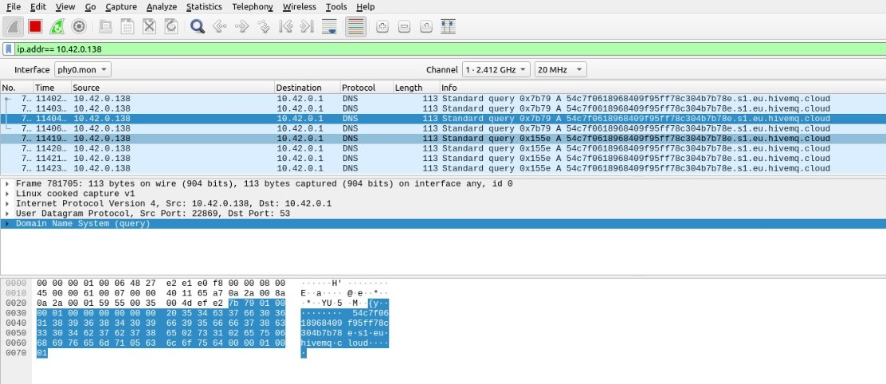

# Individual project #
Individual project for "IoT - Alogorithms and Services 2023-2024" course.

Lorenzo Pecorari - 1885161 - pecorari.1885161@studenti.uniroma1.it

The main goal of the project is to provide a system that should be able to collect information, compute an aggregate function and communicate the results to a server. Through sensors and the Fast Fourirer Transofrm, the microcontroller have to compute the maximum frequency of an unknown signal given as input in order to find the new sampling frequency and compute a new collection of data: the adaptation to this new frequency should allow to increase the energy saving. After computing a new collection of data basing on this new frequency, the ESP32-S3 have to send the new computation to a server using the WiFi connection.

## Hardware and Software
The required material for this project is the following:
<li>Espressif ESP32-S3 v3.1</li>
<li>Arduino Uno</li>
<li>Ina219</li>
<li>"Analog audio input" circuit</li>
<li>Jumper cables</li>
<li>2x USB Type-C cables</li>
 
Software, frameworks, libraries and services used for the handling the hardware are the following:
<li>FreeRTOS</li>
<li>ESP-IDF</li>
<li>ESP-DSC</li>
<li>HiveMQ</li>
<li>MQTT Explorer</li>
<li>Arduino IDE</li>
<li>Wireshark</li>

## Setting up everything
In order to make working the code contained into this repository, is needed to open an ESP-IDF terminal into the folder <code>codes/delivery</code> and executing the command <code>idf.py build</code>. After that, connect the ESP32 to the audio circuit in order to give power supply and same ground to this last one but the output pin connected to the GPIO_NUM_1. Once that, execute <code>idf.py flash</code> and connect the audio connector to the dedicated output port of the device that will reproduce the signal to be given as input to the microcontroller. After starting to play the signal, it is possible to start to monitor what the ESP32 does through <code>idf.py monitor</code>. A visible output is returned to the user thanks to some prints on the terminal window.

For the energy consumption monitoring, is needed to connect the Ina219 between the power supply and the ESP32 itself while the pins to the equivalent ones on the Arduino Uno. The output of this microcontroller can be visualized using a serial monitor with baud rate 115200.

## Maximum sampling frequency
Since the device offers the possibility to capture analog signal from the external world, using the ADC (analog to digital converter) is possible to convert that signal into a flow of digital values. 

All the following functions are implemented into the <code>adc_fft_utils.h</code> file.

### Capturing the analog signal
The initialization of that tool is executed through the <code>init_adc()</code> function: it sets the unit #1 with an attenuation of 12 dB and the default bit value for the width. Those values are chosen in order to achieve a good accuracy for the input signal. 

Values are being detected using the <code>get_adc_values()</code> function. This one get the voltage from the configured pin (<code>GPIO_NUM_1</code>) and stores it into the variable <code>input</code>, an array of <code>SAMPLES</code> float values. This constant number of values corresponds to 1024.

Between each sample, the code throws a delay of a value of <code>duration</code> ms. The value of this variable depends on what is the sampling frequency adopted by the system; for the initial phase (oversampling) it is applied a frequency of 1000 Hz

### FFT - Fast Fourier Transform
After sampling the external input, the system computes the FFT for achieving the maximum frequency of the signal. 

In order to avoid borders discontinuity the signal may suffer, it is needed to generate and multiply the input signal for the Hann window before filling the variable that will be used for computing the FFT. The variable <code>output</code> is an array of <code> 2 * SAMPLES</code> float values: each of them will have the value of the previous multiplication if the index is even or zero otherwise. This choice was done in order to allow the library function to compute operation only on one real signal, given that the imaginary one is null.

The final result obtained from the library function <code>dsps_fft2r_fc32()</code> will be bit-reversed and transformed into two real signal (all into the same array).

For computing the power spectrum of the signal, the variable <code>final</code>, an array of <code>FINAL_SIZE</code> = <code>SAMPLES / 2</code> floats, will have, in dB10, the maximum of one of each value of the outputs array previously computed (into <code>output</code>).

### Computing the maximum frequency
In order to find relevant values, it is useful to determine the z-score value on each element of <code>final</code>. 

This mathematical-statistical tools allows to compute the "weight" of a specific value onto a distrubution of values. It is obtainable from the quotient between the difference of the value and the mean value and the standard deviation of that set of samples.The result of that computation returs if that value is an outlier or not.

After executing the function <code>max_freq_calc()</code>, the system finds the outlier value with higher frequency: in other words, the value with a relevant weight that has the higher value. That index, return value of <code>max_f_idx()</code>, will be divided by the value of <code>duration</code>.
 The follwing result is obtained by the formula that allows to find the sampling frequqncy: 

 $$
\text{maximum frequency} = \left( \frac{\text{maximum index}}{\text{SAMPLES}} \right) \times \text{(sampling frequency)} = \left( \frac{\text{maximum index}}{\text{SAMPLES}} \right) \times \left( \frac{\text{SAMPLES}}{\text{duration}} \right) = \left( \frac{\text{maximum index}}{\text{duration}} \right)
$$ .

 That new frequency represents the maximum frequqncy of the input signal and, thanks to the Sampling theorem, it is possible to set the new sampling frequqncy to:  

$$
\text{samping frequency} \geq 2 \times \text{maximum frequency} = 2 \times \left( \frac{\text{maximum index}}{\text{duration}} \right)
$$ .

In order to avoid possible leaks during the sampling, the new sampling frequqncy adopted by the system is equal to 2,01 times that new maximum frequqncy found. Consequently, the new value of duration will be:  

$$
\text {duration} = \left(\frac{\text{SAMPLES}}{\text{2.01 sampling frequqncy}} \right)
$$ .

### Aggregate function over a window
Once the optimal frequqncy is known, it can be sampled a new set of values that allows to save a certain amount of energy with respect to the oversampling situation. The aggregate function over a temporal window can now be computed using that and, given a time interval, the system will perform the collection of values. Using the function <code>aggregate_over_window()</code> it is possible to do that.

Starting from the time given as input to the function, the number of samples the system have to take, is obtained from the ceil of the quotient betweer the time expressed in seconds above the variable <code>duration</code>. Analogously, the ceil of those samples and <code>SAMPLES</code> returns the number of cycles needed to satisfy that window. With a double cycle, the system takes the input from ADC and uses an array to track the intermediate values computed over each cycle. In the end, the sum of those average values will be divided by the number of cycles.

## Communication with the nearby server
The locally computed values have to be send to an edge server using MQTT in a secure way.

The following cited functions are implemented into <code>mqtt_utils.h</code> and <code>wifi_utils.h</code>.

### Connecting to a WiFi router
The essential step for connecting to the server is inside the connection to a WiFi router that allows to connect over the Internet.

Most of events of that are related to it being caputered by the ad hoc function <code>event_handler()</code> that have the role to manage events and possible reconnection to the router. Inside the system, this function is used by two different variable that have the aim to trigger it once an event of WiFi or IP address occurs.

Through some library functions, the microcontroller tries to connect to the router in "station" mode, a way to behave as a client into the network, having its own MAC and IP address. It is also required to being authenticated using credentials if the router requires them.

### MQTT communication
As soon as the system is connected to the router, it will try to connect to the server that behaves as a broker. 

Using HiveMQ with an authenticated communication using credentials and a TLS certificate, the ESP32 is capable to communicate with the broker, connecting, subscribing and subscribing to a certain topic other than publishing and receiving messages. The certificate is manually given by using the command <code>openssl s_client -connect HOSTNAME.s1.eu.hivemq.cloud:PORT -showcerts > CERTIFICATE_NAME.txt</code>. The result stores information into a txt file and, from it, is needed to take the take the second certificate in it, representing the CA root certificate, and saving it into a file with one of the compatible extensions for certificates (ex. <code>pem</code>). After converting the certificate into a stream of bytes through the command <code>xxd -i CERTIFICATE_NAME.pem > CERTIFICATE_NAME.h</code>, the system retrieves it by the include into the file that needed it. In this project, the population of the fields <code>broker</code> and <code>credentials</code> of the structure <code>conf</code>, which type is <code>esp_mqtt_client_config_t</code>, guarantees correct connection to the broker.

Through <code>start_mqtt()</code> the system can initializate the connection to the server and start the client, managing events with the function <code>esp_mqtt_client_init()</code>.

After the computation of the aggregate function into the previously called functions, it is possible to send those vales thanks to the function <code>send_value_to_broker()</code>: it takes two variables as input and generate a string representing the message to send to the broker. More in detail, the message is published using the library function <code>esp_mqtt_client_publish()</code>.

Sended/published messages can be simply seen using the software "MQTT Explorer" with same credentials, host and port inserted into the code.

### Closing the communication
When all the tasks the system have to execute are done, it close the connection to the client, destroys the variable that handles it and procedes with the disconnection from the router that provides access to the Internet. Note: for achieving the connection closure with the nroker, it is needed a new and different <code>task</code> performing the function <code>client_stop_task()</code> that uses the library functions dedicate to this job. 

## Energy consumption
For analysing better how the optimized sampling frequqncy affects energy consumption, inside <code>main.c</code> is implemented a little set of instructions that performs 20 cycles of oversampling, a delay, computes the FFT for finding the maximum and optimal sampling frequencies, newly a delay and other 20 cycles of sampling using the new sampling rate. The adaptation of the frequqncy to a reasonably rate for the input signal generates, as predicted, an improvements in terms of power utilization. In fact, the values of the mW decreases between the two set of sampling-cycles but not so significantly as expected. Even if this may be caused by noises or a not so high accuracy of the instruments used for the measurements, there are no peaks higher than the ones revealed during the oversampling and there are also some "lower" peaks that in the previous case are not detected. Here the plot with the results: 

 

The obtained results are obtained from the sampling of a sum of three different sinusoids with different frequencies (71, 183, 260 Hz) and they were played by the Python script <code>wave_sound.py</code> and detected using the "audio" circuit.

Since it can be difficult to appreciate values from the graph, with the project is also provided a txt file containing the values sampled by the Arduino. For plotting and saving the results it was used a Python script (<code>plotter_uno.py</code>), included into the folder containing the "measurements" folder; for detecting the values from the Ina219 using the Arduino Uno it was used the script provided during the lectures with some modifications in order to achieve the goal for this project: also this is available in the previously cited directory.

With the usual implementation of <code>main.c</code>, it is possible to evaluate a similarity with respect to the situation that does not take care of the connection to the Internet and the communication with the broker. As the theory suggests, wireless communicaation are really energy wasting for every type of electronical device: same, or even worse, for microcontrollers. An analysis of the power consumption of the full functionalities provided by the project underlines that the moments where the ESP32 requires more energy are related to the WiFi and MQTT events:

The signal given as input is the same as before, allowing to notice, a similar (slightly higher) power consumption into the local computation time periods but an evident higher need for energy when transmitting. Important aspect to consider is the fact that more variables are maintained in memory and more initialization procedures and library functions are involved also in local computation so the higher power consumption can be justified also by that.

## Latency
The end-to-end latency is calculated by and estimation of the times from the generation of the data to the reaching of them by the server. In fact, before invoking <code>esp_mqtt_client_publish()</code> and after detecting the capture of the event <code>MQTT_EVENT_DATA</code> it is taken the time of the microcontroller through <code>esp_timer_get_time()</code>. Computing the difference between these two values makes the system aware, with a good approximation, of the latency requested. After some execution, the average values of latency are included into the range from 70ms to 100ms.

## Volume of transmitted data
Since the data sent over the network are not composed only by the MQTT packets but mainly by WiFi packets that encapsulate them, it can be more difficult to find the volume. Using a spoofing software as Wireshark, this value can be evaluated: modifing the code in order to send packets (containing different values of sampled signals) repeatly, allows to discover that the lenght of each packet is equal to 113 Bytes. Due to the fact that values published are the man computed over the a window through the aggregate function and the "length" of each float transformed into a string is the same, it is possible to conclude that, with the assumption made during the realization of the project, the size of the packets is always the same with both of the sasmpling frequqncy (higher than needed vs optimal one). Follows a screenshot of a newtowrk traffic:
